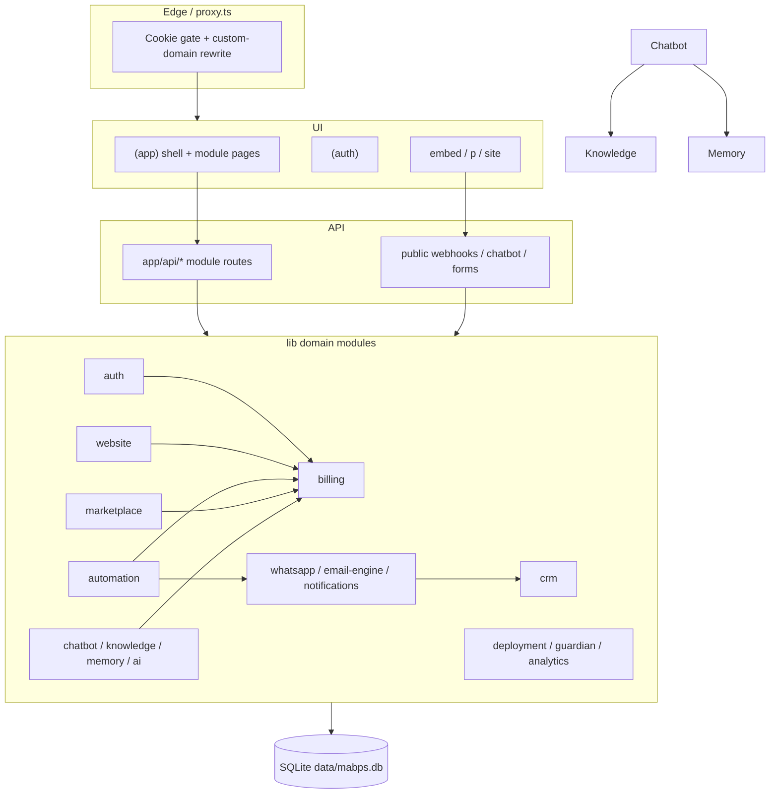

# MABPS Platform — Architecture Audit

**Audit date:** 2026-07-19  
**Scope:** Entire repository (`app/`, `components/`, `lib/`, `scripts/`, `docs/`, config, env)  
**Method:** Static code review of all implemented modules; no runtime load tests  
**Constraint:** Findings only — no code was modified

---

## 1. Executive summary

MABPS is a **modular monolith** on Next.js 16 + React 19 + Better Auth + SQLite (`better-sqlite3`), with ~17 domain modules under `lib/`, 218 API routes, 127 pages, and 142 component files. Product surface area is large and largely wired (auth → billing → website/CRM → channels → AI/knowledge/memory → automation → marketplace/guardian/deployment).

**Overall health:** Structurally coherent as a monolith, but operationally fragile for production multi-tenant SaaS.

| Dimension | Verdict |
| --- | --- |
| Module coverage vs V1 order | Strong — core stack through marketplace is present |
| Cross-module wiring | Good hubs (billing entitlements, CRM sync, automation events, AI tools) |
| Consistency | Weak — naming splits, duplicated access/http, uneven API shapes |
| Security | Critical issues on public surfaces (media cookie bypass, unsigned WhatsApp webhook, no rate limits) |
| Scalability | SQLite single-node + sync I/O + in-request queue processing |
| Docs / scaffolding | Many empty placeholders (`features/`, empty `docs/*`, empty route groups) |
| Env completeness | Knowledge/embeddings + `NEXT_PUBLIC_APP_URL` used but undocumented |

**Top 5 blockers before production:**

1. Validate sessions for unpublished media (stop cookie-substring checks).
2. Verify Meta WhatsApp webhook signatures on POST.
3. Add rate limiting on all public endpoints.
4. Fix Guardian integrity table names; add marketplace migrate script.
5. Resolve naming/structure debt (`sites`/`website`, `automations`/`automation`, `email`/`email-engine`) and remove empty scaffolding.

---

## 2. Inventory of implemented modules

### 2.1 Layer map

| Layer | Location | Count / notes |
| --- | --- | --- |
| Domain logic | `lib/*` | 17 modules + `lib/email.ts` (auth mail) + `lib/db` |
| HTTP API | `app/api/*` | 218 `route.ts` files across 16 top-level modules |
| Authenticated UI | `app/(app)/*` | 18 product areas, 118+ pages under `(app)` |
| Auth UI | `app/(auth)/*` | login, signup, forgot/reset password, accept-invite |
| Public UI | `app/embed`, `app/p`, `app/site` | chatbot embed + published sites |
| Components | `components/*` | 16 domain folders |
| Migrations | `scripts/migrate-*.mjs` | 14 CLI migrators (**marketplace missing**) |
| Schemas | `lib/**/schema.sql` | 16 SQL files |

### 2.2 Module status matrix

| Module | `lib/` | `app/api/` | `app/(app)/` UI | `components/` | Schema | CLI migrate | Entitlement hooks |
| --- | --- | --- | --- | --- | --- | --- | --- |
| Auth / workspace | `lib/auth` | `api/auth` | `(auth)` + settings | `auth` | `lib/db/schema.sql` | `db:migrate` (Better Auth) | creates free sub |
| Billing | `lib/billing` | `api/billing` | `settings/workspace/billing` | `billing` | yes | yes | — |
| Website / Sites | `lib/website` | `api/website` | `sites` | `website` | yes | yes | sites, storageMb |
| CRM | `lib/crm` | `api/crm` | `crm` | `crm` | yes | yes | — |
| Chatbot | `lib/chatbot` | `api/chatbot` | `chatbot` | `chatbot` | yes | yes | (via AI credits path) |
| Knowledge | `lib/knowledge` | `api/knowledge` | `knowledge` | `knowledge` | yes | yes | — |
| Memory | `lib/memory` | `api/memory` | `memory` | `memory` | yes | yes | — |
| AI assistant | `lib/ai` | `api/ai` | `ai` | `ai` | yes | yes | aiCredits |
| Automation | `lib/automation` | `api/automation` | `automations` | `automation` | yes | yes | automations |
| WhatsApp | `lib/whatsapp` | `api/whatsapp` | `whatsapp` | `whatsapp` | yes | yes | — |
| Email | `lib/email-engine` | `api/email` | `email` | `email` | yes | yes (`migrate-email`) | — |
| Notifications | `lib/notifications` | `api/notifications` | `notifications` | `notifications` | yes | yes | — |
| Analytics | `lib/analytics` | `api/analytics` | `analytics` | `analytics` | yes | yes | reads usage |
| Deployment | `lib/deployment` | `api/deployment` | `deployment` | `deployment` | yes | yes | — |
| Guardian | `lib/guardian` | `api/guardian` | `guardian` | `guardian` | yes | yes | — |
| Marketplace | `lib/marketplace` | `api/marketplace` | `marketplace` | `marketplace` | yes | **NO** | plugins |
| Dashboard | — | — | `dashboard` | via `analytics` | — | — | — |
| Onboarding | — | — | `onboarding` | uses auth | — | — | — |

### 2.3 Planned but not implemented (from `MABPS_MASTER_STACK.md`)

| Planned module | Status |
| --- | --- |
| Products | Not implemented (empty `features/products` only) |
| Categories | Not implemented |
| File Manager (standalone) | Partial via website media only |
| CMS (standalone) | Folded into website builder |
| Media Library (standalone) | Folded into `website` media |
| Plugin System (generic) | Partial via marketplace sandbox/SDK |

### 2.4 Empty / placeholder scaffolding

| Path | Status |
| --- | --- |
| `features/*` (12 dirs) | **0 files** — unused |
| `services/` | Empty |
| `store/` | Empty |
| `types/` | Empty |
| `hooks/` | Empty |
| `app/(dashboard)/` | Empty (real dashboard is `app/(app)/dashboard`) |
| `app/(website)/` | Empty (admin is `sites`; public is `app/p` + `app/site`) |
| `docs/ARCHITECTURE.md`, `DATABASE.md`, `MODULES.md`, `ROADMAP.md`, `TECH_STACK.md`, `VISION.md`, `CHECKLIST.md`, `IDEAS.md`, `OPEN_SOURCE.md` | **0 bytes** |
| `docs/V1_SCOPE.md` | Stub checklist only |
| `README.md` | Still create-next-app boilerplate |

---

## 3. Target architecture (as implemented)



**Pattern per feature module (dominant):**

`schema.sql` → `migrate.ts` → `repository.ts` → `engine/*` → `access.ts` + `http.ts` → `app/api/<module>/*` → `components/<module>/*` → `app/(app)/<ui>/*`

---

## 4. Folder structure verification

### 4.1 What works

- Clear three-layer split: `lib` (domain) / `app/api` (transport) / `components` + `app/(app)` (UI).
- Module layouts + `*-subnav.tsx` for most product areas.
- Shared DB singleton at `lib/db`.
- Public vs authenticated surfaces separated (`embed`, `p`, `site` vs `(app)`).

### 4.2 Structural problems

| Issue | Detail |
| --- | --- |
| Empty route groups | `(dashboard)`, `(website)` confuse navigation mental model |
| Unused top-level dirs | `features/`, `services/`, `store/`, `types/`, `hooks/` never imported |
| Auth edge entry | Logic in `proxy.ts` (Next 16), not `middleware.ts` — easy to miss |
| Billing UI nesting | Only billing lives under `settings/`; all other products are top-level |
| Dashboard ownership | Page at `app/(app)/dashboard`; implementation in `components/analytics/dashboard-home.tsx` |
| Dual knowledge | Workspace `knowledge` + `chatbot/knowledge` (local bot KB) |
| Dual email | `lib/email.ts` (auth) vs `lib/email-engine/` (product) |
| Utilities in components | e.g. `components/crm/format.ts` belongs under `lib/crm` |
| Docs debt | Most architecture docs empty; this audit is the first filled architecture artifact |

### 4.3 Recommended canonical layout (guidance only)

```
lib/<module>/{schema.sql,migrate.ts,types.ts,defaults.ts,repository.ts,access.ts,http.ts,index.ts,engine/}
app/api/<module>/...
components/<module>/...
app/(app)/<module>/...   # UI name should match API/lib where possible
scripts/migrate-<module>.mjs
```

---

## 5. Duplicate code

### 5.1 Near-identical copies (high priority to consolidate)

| Pattern | Locations | Lines (approx) | Risk |
| --- | --- | --- | --- |
| `access.ts` session→org→role gate | 15 modules | ~101–117 each | Drift in auth rules |
| `http.ts` error mapping | 15 modules | ~27–121 each | Inconsistent status heuristics |
| `migrate.ts` schema bootstrap | All feature modules | Identical shape | OK but repetitive |
| `scripts/migrate-*.mjs` | 14 files | Near-identical | Marketplace omitted |
| AI provider clients | `lib/ai/providers/*` ↔ `lib/chatbot/providers/*` | Parallel openai/gemini/openrouter | Dual maintenance |
| Knowledge chunking/storage | `lib/chatbot/knowledge/*` ↔ `lib/knowledge/*` | Overlapping concepts | Divergent retrieval quality |
| CRM sync helpers | whatsapp / email-engine / notifications / chatbot leads | Parallel sync | Inconsistent field mapping |
| Helpers | `maskSecret`, `slugify`, `normalizeEmail`, `truncateSummary` | Scattered across defaults | Copy-paste drift |

### 5.2 Acceptable duplication

- Per-module `types.ts` / domain-specific `engine/` code.
- Auth mail (`lib/email.ts`) vs product email engine (different audiences).
- Module-specific repository SQL (necessary without an ORM).

### 5.3 Consolidation recommendation

Extract shared packages (conceptually):

- `lib/platform/access.ts` — `requireMemberApi` / `requireManagerApi`
- `lib/platform/http.ts` — unified `errorResponse`
- `lib/platform/migrate.ts` — schema loader
- `lib/platform/secrets.ts` — mask/normalize helpers
- Shared LLM provider adapter used by both AI and chatbot

---

## 6. Unused files and dead surfaces

### 6.1 Confirmed unused (safe to remove or ignore)

| Item | Evidence |
| --- | --- |
| `features/**` (all 12 dirs) | Zero files; no imports |
| `services/`, `store/`, `types/`, `hooks/` | Empty directories |
| `app/(dashboard)/`, `app/(website)/` | Empty route groups |
| Empty docs listed in §2.4 | Zero bytes; not referenced by code |
| `NEXT_PUBLIC_STRIPE_PUBLISHABLE_KEY` | In `.env.example` only; no TS usage |

### 6.2 Partially dead / incomplete wiring

| Item | Evidence |
| --- | --- |
| Marketplace CLI migrate | `lib/marketplace/migrate.ts` + `schema.sql` exist; no `scripts/migrate-marketplace.mjs` / `db:migrate:marketplace` |
| Guardian `MODULE_SCHEMA_TABLES` | Expects `billing_subscription`, `notification_item` — tables do not exist (`subscription`, `notification`) |
| Guardian module coverage | Omits marketplace, whatsapp, email, knowledge, memory, chatbot from integrity map |
| `proxy.ts` `protectedPrefixes` | Omits `/guardian`, `/knowledge`, `/memory`, `/automations`, `/marketplace` (layouts still auth) |
| Master stack Products/Categories | Listed in `MABPS_MASTER_STACK.md` but no implementation |

### 6.3 Not unused (keep)

- Chatbot-local knowledge + workspace knowledge (both called from chatbot engine).
- `lib/email.ts` (auth) + `lib/email-engine` (product).
- Public API routes without pages (webhooks, trackers, plugin runtime) — intentional.

---

## 7. Missing integrations

### 7.1 Cross-module gaps

| Integration | Status | Notes |
| --- | --- | --- |
| Billing ↔ website/automation/marketplace/AI | Present | `assertWithinLimit` on sites, storage, automations, plugins, aiCredits |
| Billing ↔ CRM member limits | Partial | Members counted; CRM entity limits not entitlement-gated |
| Chatbot ↔ knowledge/memory/whatsapp/CRM | Present | Consumers + bridges exist |
| Automation ↔ email/whatsapp/notifications/knowledge | Present | Providers + dynamic knowledge import |
| AI tools ↔ most modules | Present | Facade over analytics, CRM, website, guardian, etc. |
| Deployment ↔ website | Weak | `siteId` column / soft link; no hard `lib/website` import coupling |
| Marketplace ↔ host modules | Partial | Sandbox dry-run; plugin actions map to hooks; unknown actions default to **no permissions** |
| Analytics event ingestion from all modules | Partial | Consumers exist; not every domain emits consistently |
| Guardian ↔ full schema set | Incomplete | Integrity checks miss several modules / wrong table names |
| Products / Categories / File Manager | Missing | In master stack, not built |
| Marketplace install ↔ billing purchase table | Schema has `marketplace_purchase`; verify end-to-end purchase flow maturity |

### 7.2 Operational integration gaps

- No background worker process — automation queue drained **inside HTTP handlers**.
- No shared event bus — ad-hoc `emit*` + `processAutomationQueue` calls.
- No centralized secrets vault — provider keys plaintext in SQLite.
- No CDN/object store for media — local filesystem under uploads.

---

## 8. Inconsistent naming

| Concept | Names in use | Severity |
| --- | --- | --- |
| Website builder | UI `sites` · API/lib/components `website` · empty `(website)` · public `p` + `site` · analytics `/analytics/website` | High |
| Automation | UI `automations` · API/lib/components `automation` | High |
| Email | UI/API `email` · lib `email-engine` · auth helper `lib/email.ts` | High |
| Billing | UI `settings/workspace/billing` · API/lib `billing` | Medium |
| Knowledge | `knowledge` + `kb_*` tables + chatbot `knowledge` | Medium |
| Analytics API path | UI `/analytics/api` · API `/api/analytics/api-usage` | Medium |
| Billing tables | `billing_customer` vs bare `subscription` / `invoice` | Medium |
| Notifications table | Guardian expects `notification_item`; actual `notification` | High (broken check) |
| Features scaffolding | `website-builder`, `subscription`, `products` ≠ real module names | Low (unused) |
| Auth | Better Auth org = “workspace” in product language | Medium (documented in auth docs) |

**Naming policy recommendation:** Pick one public name per domain and align UI path, API prefix, `lib/` folder, and `components/` folder. Keep DB table prefixes stable once chosen.

---

## 9. Environment variables

### 9.1 Documented in `.env.example`

| Variable | Required? |
| --- | --- |
| `BETTER_AUTH_SECRET` | Yes |
| `BETTER_AUTH_URL` | Yes |
| `DATABASE_URL` | Yes |
| `GOOGLE_CLIENT_ID` / `GOOGLE_CLIENT_SECRET` | Optional |
| `RESEND_API_KEY` / `EMAIL_FROM` | Optional |
| `STRIPE_SECRET_KEY` / `STRIPE_WEBHOOK_SECRET` | For paid billing |
| `STRIPE_PRICE_{STARTER\|PRO\|ENTERPRISE}_{MONTHLY\|YEARLY}` | For paid billing |
| `NEXT_PUBLIC_STRIPE_PUBLISHABLE_KEY` | Documented, **unused in code** |

### 9.2 Used in code but missing from `.env.example`

| Variable | Consumers |
| --- | --- |
| `NEXT_PUBLIC_APP_URL` | `proxy.ts`, Stripe base URL, OpenRouter referer, email tracking, settings pages, guardian |
| `OPENAI_API_KEY` | Knowledge embeddings |
| `MABPS_OPENAI_API_KEY` | Knowledge embeddings (alias) |
| `MABPS_KB_EMBEDDING_MODEL` | OpenAI embedder |
| `OPENAI_BASE_URL` | OpenAI embedder |
| `MABPS_KB_EMBEDDING_PROVIDER` | Embeddings factory |
| `MABPS_KB_VECTOR_STORE` | Vector store selection (default `sqlite`) |

### 9.3 Runtime-only (OK if undocumented)

- `NODE_ENV`

### 9.4 Env-related code issues

- Guardian `REQUIRED_ENV_VARS` / `RECOMMENDED_ENV_VARS` omit OpenAI/KB vars and Stripe price IDs.
- Local `.env` typically has fewer keys than production needs (auth + Google only in common local setups) — knowledge/embeddings silently degrade without keys.

---

## 10. Security issues

Severity: **Critical** / **High** / **Medium** / **Low**

### 10.1 Critical

| ID | Finding | Evidence |
| --- | --- | --- |
| S1 | Unpublished media accessible with forged cookie substring | `app/api/website/media/file/[mediaId]/route.ts` checks `cookie.includes("better-auth")` instead of `auth.api.getSession` |
| S2 | WhatsApp webhook POST has no signature verification | `app/api/whatsapp/webhook/route.ts` accepts any JSON; no `X-Hub-Signature-256` |
| S3 | No rate limiting anywhere | Zero `rateLimit` / similar matches — public chatbot, forms, webhooks, tracking, automation triggers unbounded |

### 10.2 High

| ID | Finding | Evidence |
| --- | --- | --- |
| S4 | Public automation webhook processes **global** queue | `processAutomationQueue` not workspace-scoped when called from public routes |
| S5 | Stored XSS risk on public sites | `dangerouslySetInnerHTML` for `seo.jsonLd` and rich HTML without sanitization |
| S6 | SVG uploads allowed | Website media MIME allowlist includes `image/svg+xml` |
| S7 | Provider secrets stored plaintext in SQLite | AI/chatbot API keys, email SMTP/Resend/SES, WhatsApp tokens, deployment tokens |
| S8 | Automation API keys / webhook secrets in URL paths | Leak via logs, Referer, browser history |
| S9 | Marketplace unknown plugin actions default-allow permissions | `actionPermissions` `default: return []` in `lib/marketplace/plugin-api.ts` |

### 10.3 Medium

| ID | Finding | Evidence |
| --- | --- | --- |
| S10 | Chatbot public transcript readable with `publicKey` + `conversationId` | No visitor-bound session secret on message GET |
| S11 | Public form / chatbot lead spam | No CAPTCHA / rate limit |
| S12 | Stale proxy protected prefixes | Newer modules omitted from optimistic cookie redirect |
| S13 | Email webhook GET discloses `workspaceId` when secret known | Info disclosure |
| S14 | Path containment for knowledge file reads weaker than media | Media has uploads-root check; knowledge path containment incomplete |
| S15 | CSRF relies on cookie SameSite defaults | No explicit CSRF tokens; typical for Better Auth but not hardened |

### 10.4 Positive controls observed

- Most authenticated APIs use per-module `require*MemberApi` / `require*ManagerApi` and compare `workspaceId`.
- Stripe webhook signature verification present when secret configured.
- Marketplace sandbox intentionally avoids `eval` / dynamic import of untrusted code; network dry-run.
- SQL mostly uses bound parameters (`?`); table-name interpolation in CRM overview uses hardcoded literals.
- `foreign_keys = ON` + WAL on SQLite.

---

## 11. Scalability problems

| Issue | Why it matters |
| --- | --- |
| Single SQLite file (`better-sqlite3`) | Cannot horizontally scale app instances without shared FS + write contention |
| Global DB singleton | One process assumed; serverless multi-instance unsafe |
| Sync schema migrate on first request | Cold-start contention; not a migration platform |
| In-request automation queue processing | HTTP latency coupled to workflow execution; noisy-neighbor across tenants |
| Local filesystem media | Not multi-node; no object storage |
| Embeddings in SQLite | Vector search will not scale with large KB corpora |
| No connection pooling / replica story | Read scaling not available |
| Organization limits (50 orgs / 100 members) | Hard-coded in auth config — product constraint, not infra |

**Scale path (recommended direction):** Postgres (or Turso/libSQL) + object storage + background workers + Redis rate limits/queues before multi-region.

---

## 12. Performance bottlenecks

| Bottleneck | Location / pattern |
| --- | --- |
| `readFileSync` / `writeFileSync` on request path | Media serve/upload; schema migrate reads |
| Marketplace sandbox wall-clock check after sync work | Blocks event loop until work finishes |
| CRM/analytics overview fan-out | Many separate `COUNT` / report queries per request |
| N+1 risk in list→detail enrichment | Common repository list patterns without joins |
| Automation queue claim not tenant-scoped from public triggers | Extra work across workspaces |
| No caching layer | Entitlements, plans, settings re-read from DB frequently |
| Embedding generation inline | Knowledge pipeline can block ingest routes |
| Flat global nav with 16+ links | UX performance / cognitive load (client render weight minor) |

---

## 13. Module communication verification

### 13.1 Communication hubs (working)

```text
auth/workspace ──ensures──► billing (free subscription)
website / automation / marketplace / ai ──assertWithinLimit──► billing
chatbot ──search──► knowledge
chatbot ──remember/search──► memory
chatbot ↔ whatsapp (channel + bridge)
whatsapp / email-engine / notifications / chatbot ──sync──► crm
automation ──providers──► email-engine, whatsapp, notifications
automation ──dynamic──► knowledge consumer
email-engine / notifications / whatsapp ──emit + processQueue──► automation
ai/tools ──facade──► analytics, automation, billing, chatbot, crm, knowledge, memory, notifications, guardian, website
ai ──shares credentials──► chatbot providers
analytics ──reads──► billing usage
deployment ··soft link··► website (siteId)
```

### 13.2 Communication defects

| Defect | Impact |
| --- | --- |
| No formal event schema/versioning | Emitters and listeners can drift silently |
| Queue processing side-effect from unrelated routes | Email send / notification send / public webhook all drain global queue |
| Marketplace plugin hooks not deeply integrated into CRM/website mutations | Sandbox-first; limited production side effects |
| Guardian integrity map stale | False confidence in “healthy” scans |
| Deployment ↔ website not bi-directional | Publish/deploy flows can diverge |

### 13.3 Verdict

Core product paths **do communicate**, primarily via direct TypeScript imports (not HTTP inter-service calls). That is correct for a monolith, but coupling is tight and there is no isolation boundary for failure domains (one slow webhook can stall the Node process).

---

## 14. API consistency

### 14.1 Shared conventions (mostly followed)

1. `try/catch` in route handlers  
2. Auth via `require*MemberApi` / `require*ManagerApi`  
3. Errors as `{ error: string }` via module `*ErrorResponse`  
4. JSON success payloads  

### 14.2 Inconsistencies

| Area | Variation |
| --- | --- |
| Overview keys | `{ overview }` (automation/guardian/marketplace) vs `{ stats }` (CRM) vs billing’s ad-hoc shape |
| HTTP verbs | CRM uses REST PATCH/DELETE; marketplace uses POST `…/enable`, `…/disable`, `…/update`; developer profile uses PUT |
| Auth module | Better Auth catch-all — different from domain pattern |
| Status heuristics | String-matching in `http.ts` differs per module (402/501 coverage uneven) |
| List envelopes | `{ items }` vs entity-keyed objects vs bare arrays |
| Public routes | Mixed secret-in-path, token-in-path, publicKey, Stripe signature |
| Analytics naming | `/api/analytics/api-usage` vs UI “API” |

### 14.3 API surface without dedicated pages (OK if intentional)

Guardian `checks/*`, `monitor`; deployment `monitoring`, `providers/*`; automation `events`, `queue/process`, `public/*`; marketplace `plugin/[slug]`; CRM `notes`, `search`; analytics `events`, `export`, `*/track`.

### 14.4 Recommendation

Adopt a thin shared contract:

```ts
// success
{ data: T, meta?: { total?: number; limit?: number; offset?: number } }
// error
{ error: { code: string; message: string } }
```

Keep action-routes or pure REST — pick one style per resource type and document it.

---

## 15. Database schema consistency

### 15.1 Approach

- Engine: SQLite via `better-sqlite3`
- ORM: **None** — raw SQL
- Auth schema: Better Auth CLI (`lib/db/schema.sql`)
- Feature schemas: per-module `schema.sql` + lazy `migrate.ts` (+ CLI scripts)
- IDs: text UUIDs
- Columns: predominantly quoted **camelCase** (`"workspaceId"`, `"createdAt"`)
- FKs: most feature tables reference `organization(id)` as workspace

### 15.2 Table inventory (by schema file)

| Schema | Tables |
| --- | --- |
| `lib/db/schema.sql` | `user`, `session`, `account`, `verification`, `organization`, `member`, `invitation` |
| `lib/billing/schema.sql` | `billing_customer`, `subscription`, `invoice`, `usage_counter`, `stripe_webhook_event` |
| `lib/website/schema.sql` | 13 website_* tables (site→pages/sections/forms/media/blog/…) |
| `lib/crm/schema.sql` | 13 crm_* tables |
| `lib/chatbot/schema.sql` | 10 chatbot_* tables |
| `lib/ai/schema.sql` | 6 ai_* tables |
| `lib/whatsapp/schema.sql` | 9 whatsapp_* tables |
| `lib/email-engine/schema.sql` | 8 email_* tables |
| `lib/automation/schema.sql` | 6 automation_* tables |
| `lib/analytics/schema.sql` | 3 analytics_* tables |
| `lib/notifications/schema.sql` | 8 notification_* tables |
| `lib/deployment/schema.sql` | 9 deployment_* tables |
| `lib/guardian/schema.sql` | 7 guardian_* tables |
| `lib/knowledge/schema.sql` | `kb_source`, `kb_source_version`, `kb_chunk`, `kb_embedding` |
| `lib/memory/schema.sql` | `memory_entry`, `memory_embedding` |
| `lib/marketplace/schema.sql` | 7 marketplace_* tables |

### 15.3 Schema inconsistencies

| Issue | Detail |
| --- | --- |
| Prefix inconsistency | Most modules prefix tables; billing uses bare `subscription` / `invoice` |
| Knowledge prefix | `kb_*` vs module name `knowledge` |
| Timestamp types | Better Auth `date` vs feature modules `text` ISO strings |
| Guardian expectations | `billing_subscription`, `notification_item` do not match real tables |
| Marketplace migrate CLI | Schema exists; ops script missing |
| Index coverage | CRM/website/automation/marketplace relatively indexed; some modules lighter |
| No unified migration history | Lazy `IF NOT EXISTS` only — no versioned migrations / rollbacks |
| Cross-module FKs | Soft references (e.g. deployment `siteId`) without enforced FK to `website_site` in all cases |

### 15.4 Verdict

Schemas are **internally workable** per module but **not globally consistent**. Guardian’s integrity map is actively wrong for billing/notifications, which undermines the ops module’s purpose.

---

## 16. UI navigation consistency

### 16.1 Global nav (`app/(app)/layout.tsx`)

When workspace active, header links to:

Dashboard · Analytics · Sites · CRM · AI · WhatsApp · Email · Notifications · Deployment · Guardian · Chatbot · Knowledge · Memory · Automations · Marketplace · Workspace · Billing · Account

### 16.2 What aligns

- Each top-level nav target (except Account/Workspace) has a matching module area and subnav for deep pages.
- Module subnavs generally match their child routes.
- Site subnav under `/sites/[siteId]` matches site child pages.

### 16.3 Gaps / mismatches

| Issue | Detail |
| --- | --- |
| Flat overcrowded header | ~16 workspace links; no grouping (Build / Engage / Ops / AI) |
| Settings subpages not in global nav | Members/invitations only via workspace page |
| Billing as top-level label | Path is nested under settings |
| Onboarding excluded | Correct, but no post-onboarding checklist in nav |
| Proxy vs layout protection mismatch | Layout requires session; proxy omits newer modules → inconsistent redirect UX |
| Mobile nav | Header nav is `hidden … sm:flex` — no mobile menu pattern observed |
| Analytics “API” vs API path naming | UI/API vocabulary diverge |
| Empty route groups | Leftover `(dashboard)` / `(website)` |

### 16.4 Verdict

Navigation is **functionally complete** for implemented modules but **UX-inconsistent** (crowding, naming, proxy staleness). Subnavs are the stronger consistency layer.

---

## 17. Coding standards verification

### 17.1 Configured standards

| Tool | Config | Assessment |
| --- | --- | --- |
| TypeScript | `strict: true` | Good baseline |
| ESLint | `eslint-config-next` core-web-vitals + typescript | Present |
| Path alias | `@/*` | Used consistently |
| Next config | Empty stub | No security headers, image domains, etc. |
| Package manager | npm / lockfile present | OK |

### 17.2 Observed conventions (positive)

- Server-first App Router pages with access helpers.
- Domain logic kept out of React components into `lib/`.
- UUID text IDs + workspace scoping as tenancy model.
- Plan entitlements centralized in `lib/billing/entitlements.ts`.

### 17.3 Standard violations / drift

| Issue | Detail |
| --- | --- |
| Massive access/http duplication | Should be shared platform helpers |
| Inconsistent API response envelopes | See §14 |
| Inconsistent REST vs action-routes | See §14 |
| Secrets handling | Plaintext DB; no encryption helper standard |
| Error logging | `console.error("[module]", …)` ad-hoc; no structured logger |
| Tests | No meaningful automated test suite observed for domain modules |
| README / docs | Boilerplate + empty architecture docs |
| Feature folder convention abandoned | `features/` empty; real code in `lib` + `app` |
| Sync FS APIs in request handlers | Against typical Next.js async I/O guidance |
| React performance APIs | Not systematically used (acceptable if React Compiler; not documented) |

### 17.4 Dependency footprint

Production deps are intentionally small (`better-auth`, `better-sqlite3`, `next`, `react`, `stripe`). Heavy features (embeddings, WhatsApp, email, deployment providers) are implemented with `fetch` + raw SQL rather than many SDKs — good for control, but increases custom security surface.

---

## 18. Module-by-module risk notes (condensed)

| Module | Strength | Primary risk |
| --- | --- | --- |
| Auth | Better Auth + org model solid | Cookie-optimistic proxy; org create open to all users |
| Billing | Plans + Stripe + entitlements | Bare table names; unused publishable key doc |
| Website | Full builder surface | Media auth bypass; XSS; sync FS |
| CRM | Broad entity API | No entitlement limits on records volume |
| Chatbot | Public widget + channels | Abuse/spam; dual KB complexity |
| Knowledge | Pipeline + embeddings | Undocumented env; SQLite vectors |
| Memory | Consumer API for chatbot/auto | Same embedding/env concerns |
| AI | Tool facade across platform | Credit enforcement depends on call sites |
| Automation | Workflows + queue | Global queue drain from public endpoints |
| WhatsApp | Cloud API integration | **Unsigned webhook POST** |
| Email | Campaigns + tracking | Auth mail vs engine confusion |
| Notifications | Multi-channel | Depends on email/whatsapp correctness |
| Analytics | Domain reports | Cross-table query cost |
| Deployment | Providers + domains | Secrets in DB; soft website link |
| Guardian | Scan/repair UX | Wrong expected table names; incomplete module map |
| Marketplace | Catalog/install/sandbox | Missing migrate script; default-allow unknown actions |

---

## 19. Priority remediation roadmap

### P0 — Security (do first)

1. Replace media cookie substring check with real session validation.  
2. Verify WhatsApp `X-Hub-Signature-256` (and reject unsigned POSTs).  
3. Add rate limiting to public chatbot, forms, webhooks, tracking, automation triggers.  
4. Change marketplace `actionPermissions` default to **deny**.  
5. Sanitize public HTML/JSON-LD; reconsider SVG uploads.

### P1 — Correctness / ops

6. Add `scripts/migrate-marketplace.mjs` + `db:migrate:marketplace`.  
7. Fix Guardian `MODULE_SCHEMA_TABLES` (`subscription`, `notification`, add missing modules).  
8. Scope `processAutomationQueue` by `workspaceId` when invoked from tenant public routes.  
9. Update `proxy.ts` `protectedPrefixes` for guardian/knowledge/memory/automations/marketplace.  
10. Document missing env vars in `.env.example` and Guardian checks.

### P2 — Architecture hygiene

11. Extract shared `access` / `http` / migrate helpers.  
12. Normalize naming (`sites`↔`website`, `automations`↔`automation`, `email`↔`email-engine`).  
13. Delete or populate empty `features/`, `(dashboard)`, `(website)`, empty docs.  
14. Unify AI + chatbot provider adapters.  
15. Clarify chatbot-local KB vs workspace knowledge ownership.

### P3 — Scale / performance

16. Move automation queue to a background worker.  
17. Async FS / object storage for media.  
18. Plan Postgres (or equivalent) migration path.  
19. Add caching for entitlements/settings.  
20. Encrypt provider secrets at rest.

---

## 20. Audit checklist (requirement coverage)

| Requirement | Covered in |
| --- | --- |
| Scan every implemented module | §2, §18 |
| Detect duplicate code | §5 |
| Detect unused files | §6 |
| Detect missing integrations | §7 |
| Detect inconsistent naming | §8 |
| Detect missing environment variables | §9 |
| Detect security issues | §10 |
| Detect scalability problems | §11 |
| Detect performance bottlenecks | §12 |
| Verify module communication | §13 |
| Verify API consistency | §14 |
| Verify database schema consistency | §15 |
| Verify UI navigation consistency | §16 |
| Verify folder structure | §4 |
| Verify coding standards | §17 |

---

## 21. Final verdict

The platform has **broad V1 feature coverage** and a recognizable modular-monolith shape with real cross-module wiring through billing, CRM, automation, and AI tools. It is **not yet production-hardened**: security gaps on public endpoints, SQLite/single-process scale limits, duplicated platform plumbing, naming drift, incomplete marketplace/guardian operational wiring, and empty scaffolding/docs create material risk.

Treat P0 security items as release blockers. Treat P1 ops/correctness as required before trusting Guardian or marketplace in any shared environment. Treat P2/P3 as the path from “feature-complete monolith” to “operable multi-tenant SaaS.”
