# MABPS Platform — Production Readiness Roadmap

**Source:** [ARCHITECTURE_AUDIT.md](./ARCHITECTURE_AUDIT.md) (2026-07-19)  
**Purpose:** Convert audit findings into a prioritized, effort-estimated plan for first customer → public launch → operable SaaS  
**Constraint:** Planning document only — no implementation implied by this file

---

## How to use this document

| Priority | Gate | Meaning |
| --- | --- | --- |
| **P0** | Before first paying / pilot customer | Security or data-integrity blockers. Ship without these and tenants can be breached or corrupted. |
| **P1** | Before public launch | Correctness, abuse resistance, and ops trust required for open signup / marketing traffic. |
| **P2** | After launch OK | Hygiene, consistency, and maintainability. Defer without blocking revenue. |
| **P3** | Future scale | Multi-node, storage, and platform maturity when load or team size demands it. |

**Effort scale** (one experienced engineer familiar with the repo):

| Label | Range | Guidance |
| --- | --- | --- |
| **XS** | ≤ 0.5 day | Localized fix, clear evidence in audit |
| **S** | 0.5–1 day | Single module or thin shared helper |
| **M** | 2–3 days | Cross-route or multi-file change + manual verification |
| **L** | 4–7 days | Cross-module design + migration/compat work |
| **XL** | 1–3 weeks | Infra or large refactor; may need staging soak |

Totals below are rough sums of task efforts (not calendar elapsed time). Parallelization can shorten wall-clock.

---

## Summary

| Priority | Tasks | Rough effort | Gate |
| --- | --- | --- | --- |
| P0 | 8 | ~2–3 weeks | First customer |
| P1 | 14 | ~3–4 weeks | Public launch |
| P2 | 12 | ~4–6 weeks | Post-launch hardening |
| P3 | 11 | ~2–4 months | Scale / multi-tenant ops |

**Recommended sequence:** finish all P0 → ship closed pilot → finish P1 → open public signup → schedule P2 in parallel with customer feedback → plan P3 when single-node SQLite becomes a real constraint.

---

## P0 — Must fix before first customer

Security and integrity issues that can leak unpublished media, forge channel events, spam public surfaces, or let plugins over-privilege.

| ID | Task | Audit refs | Effort | Notes |
| --- | --- | --- | --- | --- |
| P0-1 | Validate unpublished media with real session (`auth.api.getSession`), not `cookie.includes("better-auth")` | S1, §10.1, §19#1 | **S** | Highest-risk auth bypass on media file route |
| P0-2 | Verify WhatsApp webhook `X-Hub-Signature-256`; reject unsigned / invalid POSTs | S2, §10.1, §19#2 | **S** | Required before any real Meta traffic |
| P0-3 | Rate-limit all public endpoints (chatbot, forms, webhooks, tracking, automation triggers) | S3, S11, §10.1, §19#3 | **M** | Prefer shared middleware/helper; Redis optional later (in-memory OK for single-node pilot) |
| P0-4 | Marketplace `actionPermissions`: unknown actions **deny** (not empty allow) | S9, §10.2, §19#4 | **XS** | One-line semantic fix + regression check |
| P0-5 | Sanitize public site HTML / JSON-LD; stop unsafe `dangerouslySetInnerHTML` without a sanitizer | S5, §10.2, §19#5 | **M** | Cover `seo.jsonLd` and rich HTML paths on `p` / `site` |
| P0-6 | Revisit SVG uploads (block or sanitize aggressively) | S6, §10.2, §19#5 | **S** | XSS vector via stored SVG |
| P0-7 | Stop putting automation API keys / webhook secrets in URL paths | S8, §10.2 | **M** | Move to headers/body; rotate existing leaked-style URLs |
| P0-8 | Scope `processAutomationQueue` by `workspaceId` on tenant public routes | S4, §7.2, §13.2, §19#8 | **M** | Prevents global queue drain / cross-tenant work from public triggers |

**P0 subtotal:** ~9–12 engineer-days (~2–3 weeks with review + staging checks)

### P0 exit criteria

- [ ] Unpublished media returns 401/403 without a valid session for the owning workspace  
- [ ] Unsigned WhatsApp POSTs are rejected; signed happy-path still works  
- [ ] Public chatbot/forms/webhooks/triggers return 429 under burst  
- [ ] Unknown marketplace plugin actions grant no permissions  
- [ ] Public pages do not render unsanitized HTML/JSON-LD; SVG policy enforced  
- [ ] Automation secrets not required in path segments; queue processing is workspace-scoped  

---

## P1 — Must fix before public launch

Correctness, abuse resistance, env/ops completeness, and UX trust for open traffic. Pilot customers can tolerate some of these; public launch cannot.

| ID | Task | Audit refs | Effort | Notes |
| --- | --- | --- | --- | --- |
| P1-1 | Add `scripts/migrate-marketplace.mjs` + `db:migrate:marketplace` | §2.2, §6.2, §15.3, §19#6 | **S** | Mirror existing migrate CLI pattern |
| P1-2 | Fix Guardian `MODULE_SCHEMA_TABLES` (`subscription`, `notification`; drop wrong names) | §6.2, §8, §15.3, §19#7 | **S** | Integrity scans currently lie |
| P1-3 | Extend Guardian integrity map to marketplace, whatsapp, email, knowledge, memory, chatbot | §6.2, §7.1, §18 | **M** | Ops module must cover real schemas |
| P1-4 | Update `proxy.ts` `protectedPrefixes` (guardian, knowledge, memory, automations, marketplace) | S12, §6.2, §16.3, §19#9 | **XS** | Align edge redirect with layout auth |
| P1-5 | Document all used env vars in `.env.example` (`NEXT_PUBLIC_APP_URL`, OpenAI/KB vars); remove or wire unused Stripe publishable key | §9, §19#10 | **S** | Silent embedding degradation today |
| P1-6 | Align Guardian `REQUIRED_ENV_VARS` / `RECOMMENDED_ENV_VARS` with real runtime needs (KB + Stripe prices) | §9.4 | **S** | Same source of truth as `.env.example` |
| P1-7 | Bind public chatbot transcript reads to a visitor session secret (not only `publicKey` + `conversationId`) | S10, §10.3 | **M** | Prevent transcript scraping |
| P1-8 | Add CAPTCHA or equivalent challenge on public forms / chatbot lead capture | S11, §10.3 | **M** | Complements P0 rate limits |
| P1-9 | Harden knowledge file path containment to match media uploads-root checks | S14, §10.3 | **S** | Path traversal risk |
| P1-10 | Encrypt provider secrets at rest (AI, chatbot, email, WhatsApp, deployment tokens) | S7, §7.2, §19#20 | **L** | Move from P3 in audit: required before many public tenants store tokens |
| P1-11 | Add security headers / image domain policy in Next config | §17.1 | **S** | Baseline browser hardening |
| P1-12 | Mobile navigation for `(app)` shell (header currently `hidden … sm:flex` with no menu) | §16.3 | **M** | Public launch includes mobile users |
| P1-13 | Replace README boilerplate; document run/migrate/env for operators | §2.4, §17.3 | **S** | Onboarding + support burden |
| P1-14 | Smoke-test suite for P0 public surfaces (media auth, WhatsApp signature, rate limit, marketplace deny) | §17.3 | **M** | No meaningful domain tests today — block regressions |

**P1 subtotal:** ~18–24 engineer-days (~3–4 weeks)

### P1 exit criteria

- [ ] Fresh env + migrate scripts bring up auth + all feature schemas including marketplace  
- [ ] Guardian integrity passes against real table names and covers major modules  
- [ ] Proxy redirects match authenticated module set  
- [ ] New deploy checklist lists every required env; Guardian agrees  
- [ ] Public chatbot transcripts are not world-readable with guessable IDs  
- [ ] Lead spam has rate limit + challenge  
- [ ] Secrets in DB are ciphertext with documented key management  
- [ ] README is accurate; critical public-route tests exist in CI  

---

## P2 — Can wait (post-launch hygiene)

Architecture consistency, duplication, naming, and incomplete product wiring. Important for velocity; not launch blockers if P0/P1 hold.

| ID | Task | Audit refs | Effort | Notes |
| --- | --- | --- | --- | --- |
| P2-1 | Extract shared `lib/platform/{access,http,migrate,secrets}` | §5.1, §5.3, §19#11 | **L** | Stops auth/error-rule drift across 15 modules |
| P2-2 | Normalize naming: `sites`↔`website`, `automations`↔`automation`, `email`↔`email-engine` | §8, §19#12 | **L** | Pick canonical public names; keep DB prefixes stable |
| P2-3 | Remove empty scaffolding: `features/*`, `services/`, `store/`, `types/`, `hooks/`, `(dashboard)`, `(website)` | §2.4, §6.1, §19#13 | **XS** | Reduce confusion |
| P2-4 | Fill or delete empty docs; keep one architecture source of truth | §2.4, §4.2 | **M** | Point README at audit + this roadmap |
| P2-5 | Unify AI + chatbot LLM provider adapters | §5.1, §19#14 | **L** | Dual openai/gemini/openrouter clients |
| P2-6 | Clarify ownership: workspace knowledge vs chatbot-local KB | §4.2, §19#15 | **M** | Docs + API boundaries; avoid divergent retrieval |
| P2-7 | Standardize API envelopes (`{ data, meta }` / structured errors) and REST vs action-route policy | §14 | **L** | Incremental; start with new routes |
| P2-8 | Align billing table naming (`subscription` / `invoice` vs `billing_*`) or document exception | §8, §15.3 | **M** | Prefer docs + Guardian map over risky rename early |
| P2-9 | CRM record-volume entitlements (parity with sites/automations/plugins) | §7.1 | **M** | Abuse + plan fairness |
| P2-10 | Consistent analytics event emission across modules | §7.1 | §13.2 | **M** | Partial instrumentation today |
| P2-11 | Group global nav (Build / Engage / Ops / AI); fix Billing label vs nested path | §16 | **M** | Crowded 16-link header |
| P2-12 | Structured logging instead of ad-hoc `console.error("[module]", …)` | §17.3 | **M** | Needed for support once public |

**P2 subtotal:** ~25–35 engineer-days (~4–6 weeks, can be phased)

### P2 exit criteria

- [ ] New modules use platform access/http helpers only  
- [ ] Empty dirs gone; naming policy documented and mostly applied on UI/API paths  
- [ ] One provider stack for AI + chatbot  
- [ ] API style guide exists; major routes migrated or dual-supported  
- [ ] Nav is scannable on desktop; billing path/label match  

---

## P3 — Future improvements

Scale, performance, and product breadth. Schedule when pilot load, multi-instance deploy, or master-stack gaps become real constraints.

| ID | Task | Audit refs | Effort | Notes |
| --- | --- | --- | --- | --- |
| P3-1 | Background worker for automation queue (decouple from HTTP handlers) | §7.2, §11, §12, §19#16 | **XL** | Biggest noisy-neighbor fix after security |
| P3-2 | Async FS + object storage (S3/R2) for media | §7.2, §11, §12, §19#17 | **XL** | Required for multi-node |
| P3-3 | Postgres or Turso/libSQL migration path | §11, §19#18 | **XL** | Versioned migrations + cutover plan |
| P3-4 | Caching layer for entitlements / plans / settings | §12, §19#19 | **L** | Redis or equivalent |
| P3-5 | Dedicated vector store (or Postgres pgvector) for knowledge/memory embeddings | §11, §12 | **XL** | SQLite vectors will not scale |
| P3-6 | Formal event schema/versioning for automation emits | §13.2 | **L** | Replace ad-hoc `emit*` drift |
| P3-7 | Shared event bus / outbox (optional) | §7.2 | **XL** | Only if worker + multi-instance justified |
| P3-8 | Deployment ↔ website hard coupling (FK + shared publish flow) | §7.1, §13.2 | **L** | Soft `siteId` today |
| P3-9 | Marketplace install ↔ `marketplace_purchase` / billing end-to-end maturity | §7.1, §18 | **L** | Verify purchase → entitlement path |
| P3-10 | Master-stack gaps: Products, Categories, standalone File Manager (if still required) | §2.3 | **XL** | Product decision first |
| P3-11 | Performance pass: CRM/analytics fan-out, N+1 lists, marketplace sandbox wall-clock, embedding ingest off request path | §12 | **L–XL** | Profile before optimizing |

**P3 subtotal:** multi-sprint; plan as a scale program, not a single milestone

### P3 exit criteria (directional)

- [ ] App can run ≥2 instances without shared local FS for media  
- [ ] Automation work does not block request latency for other tenants  
- [ ] DB and vectors have a documented horizontal path  
- [ ] Master-stack omissions are either built or explicitly cut from product scope  

---

## Suggested implementation order

Work in **phases**. Do not start P2 refactors until P0 is done. Prefer security → ops correctness → abuse → UX → structure → scale.

```mermaid
flowchart LR
  subgraph phase1 [Phase 1 — Week 1]
    A[P0-1 Media session]
    B[P0-2 WhatsApp HMAC]
    C[P0-4 Marketplace deny]
  end

  subgraph phase2 [Phase 2 — Week 1–2]
    D[P0-5 XSS sanitize]
    E[P0-6 SVG policy]
    F[P0-3 Rate limits]
    G[P0-8 Queue scope]
    H[P0-7 Secrets out of URLs]
  end

  subgraph phase3 [Phase 3 — Pilot]
    I[P1-1 Marketplace migrate]
    J[P1-2 Guardian tables]
    K[P1-4 Proxy prefixes]
    L[P1-5 Env docs]
  end

  subgraph phase4 [Phase 4 — Pre-public]
    M[P1-3 Guardian coverage]
    N[P1-6 Guardian env]
    O[P1-7 Transcript bind]
    P[P1-8 CAPTCHA]
    Q[P1-9 Knowledge paths]
    R[P1-10 Encrypt secrets]
    S[P1-11 Headers]
    T[P1-12 Mobile nav]
    U[P1-13 README]
    V[P1-14 Smoke tests]
  end

  subgraph phase5 [Phase 5 — Post-launch]
    W[P2 platform extract]
    X[P2 naming + nav]
    Y[P2 providers + KB]
  end

  subgraph phase6 [Phase 6 — Scale]
    Z[P3 worker + storage + DB]
  end

  phase1 --> phase2 --> phase3 --> phase4 --> phase5 --> phase6
```

### Phase 1 — Critical auth/channel holes (days 1–3)

Order matters: fix the two forged-input paths first, then the one-line marketplace deny.

1. **P0-1** Media session validation  
2. **P0-2** WhatsApp signature verification  
3. **P0-4** Marketplace unknown-action deny  

**Why this order:** Immediate confidentiality (media) and integrity (WhatsApp) before broader platform work; marketplace deny is cheap insurance before any plugin demo.

### Phase 2 — Public surface hardening (days 3–10)

4. **P0-5** HTML/JSON-LD sanitization  
5. **P0-6** SVG upload policy  
6. **P0-3** Rate limiting (shared helper across public routes)  
7. **P0-8** Workspace-scoped automation queue processing  
8. **P0-7** Automation secrets out of URL paths (coordinate with any existing integrations)  

**Checkpoint:** Closed pilot / first customer allowed only after Phase 2 exit criteria (P0 checklist) pass on staging.

### Phase 3 — Ops truth for pilot (days 10–14)

9. **P1-1** Marketplace migrate CLI  
10. **P1-2** Guardian table-name fixes  
11. **P1-4** Proxy protected prefixes  
12. **P1-5** `.env.example` completeness  

**Why here:** Pilot installs must migrate marketplace and trust Guardian; env docs prevent “embeddings mysteriously off” support tickets.

### Phase 4 — Public launch bar (weeks 3–5)

13. **P1-3** Guardian full module map  
14. **P1-6** Guardian env lists  
15. **P1-14** Start smoke tests (write as you harden)  
16. **P1-9** Knowledge path containment  
17. **P1-7** Chatbot transcript binding  
18. **P1-8** CAPTCHA / lead challenge  
19. **P1-10** Encrypt secrets at rest  
20. **P1-11** Security headers  
21. **P1-12** Mobile nav  
22. **P1-13** README / operator docs  

**Checkpoint:** Public launch only after P1 exit criteria. Prefer enabling open signup behind monitoring for rate limits and webhook failures.

### Phase 5 — Maintainability (post-launch, ongoing)

Suggested order inside P2 (minimize user-facing churn first):

23. **P2-3** Delete empty scaffolding  
24. **P2-4** Docs hygiene  
25. **P2-1** Platform `access` / `http` / migrate extract (do before more modules copy-paste)  
26. **P2-11** Nav grouping + billing path clarity  
27. **P2-12** Structured logging  
28. **P2-9** CRM entitlements  
29. **P2-10** Analytics emission consistency  
30. **P2-6** Knowledge ownership clarification  
31. **P2-5** Unify LLM providers  
32. **P2-2** Naming normalization (UI/API paths; careful redirects)  
33. **P2-7** API envelope standard  
34. **P2-8** Billing table naming decision (document vs migrate)  

### Phase 6 — Scale program (when metrics demand)

Trigger P3 when any of: >1 app instance needed, media disk shared-pain, automation latency complaints, KB size blows SQLite, or multi-region plans.

35. **P3-1** Background automation worker  
36. **P3-2** Object storage for media  
37. **P3-4** Entitlement/settings cache (quick win once multi-instance)  
38. **P3-3** Postgres / libSQL path  
39. **P3-5** Vector store  
40. **P3-6** / **P3-7** Event schema (± bus)  
41. **P3-8** Deployment↔website coupling  
42. **P3-9** Marketplace purchase maturity  
43. **P3-11** Targeted performance pass  
44. **P3-10** Products/Categories/File Manager — only if product commits  

---

## Dependency map (critical path)

| Task | Depends on | Blocks |
| --- | --- | --- |
| P0-3 Rate limits | — | Safer public launch; P1-8 still recommended |
| P0-8 Queue scope | — | Trustworthy automation under load |
| P0-7 Secrets out of URLs | Coordination with existing webhook URLs | Cleaner logging / Referer safety |
| P1-2 Guardian tables | — | P1-3 meaningful coverage |
| P1-3 Guardian coverage | P1-2 | Ops confidence in “healthy” |
| P1-5 Env docs | — | P1-6; knowledge/embeddings in prod |
| P1-10 Encrypt secrets | Key/env design (`MABPS_SECRETS_KEY` or similar) | Comfortable multi-tenant secret storage |
| P1-14 Smoke tests | P0-1…P0-4 at minimum | Safe refactors in P2 |
| P2-1 Platform extract | P1-14 preferred | Faster, safer P2-2 / P2-7 |
| P2-2 Naming | Redirect/compat plan | Long-term DX |
| P3-1 Worker | Stable queue claim semantics (P0-8) | Multi-instance automation |
| P3-2 Object storage | — | Multi-instance app |
| P3-3 Postgres | Migration tooling decision | Horizontal DB scale |

---

## Tracking against audit “Top 5 blockers”

| Audit top blocker | Roadmap IDs | Priority |
| --- | --- | --- |
| Validate sessions for unpublished media | P0-1 | P0 |
| Verify Meta WhatsApp webhook signatures | P0-2 | P0 |
| Rate limiting on public endpoints | P0-3 | P0 |
| Guardian table names + marketplace migrate | P1-1, P1-2 | P1 |
| Naming/structure debt + empty scaffolding | P2-2, P2-3 | P2 |

Additional blockers elevated for production readiness beyond the audit’s short list: marketplace deny (P0-4), XSS/SVG (P0-5/6), automation secret URLs + global queue (P0-7/8), and secrets-at-rest before broad public tenancy (P1-10).

---

## Risk register (if order is skipped)

| If you skip… | Likely failure mode |
| --- | --- |
| P0-1 | Unpublished media theft via forged cookie substring |
| P0-2 | Fake inbound WhatsApp events / CRM pollution |
| P0-3 | Chatbot/form/webhook DoS; lead spam |
| P0-4 | Plugin actions escalate privileges by omission |
| P0-5/6 | Stored XSS on public sites |
| P0-7/8 | Secret leakage + cross-tenant queue side effects |
| P1 Guardian/migrate | False “healthy” ops; marketplace schema missing in prod |
| P1-10 | DB dump = full provider token compromise |
| Jumping to P3 before P0 | Scaling a vulnerable system |

---

## Final recommendation

1. **Treat P0 as a hard gate** for any real customer data or Meta/Stripe webhooks.  
2. **Run a closed pilot** after Phase 2; use Phase 3 to make migrate/Guardian/env trustworthy.  
3. **Open public signup** only after Phase 4 (full P1), with rate-limit and webhook monitoring.  
4. **Schedule P2** as continuous improvement so feature velocity does not multiply access/http/naming debt.  
5. **Open a P3 scale epic** when single-node SQLite + in-request queues + local media become measurable limits — not before.

This roadmap does not change product scope from `MABPS_MASTER_STACK.md`; Products/Categories/File Manager remain P3 product decisions, not launch blockers for the already-implemented modular monolith.
